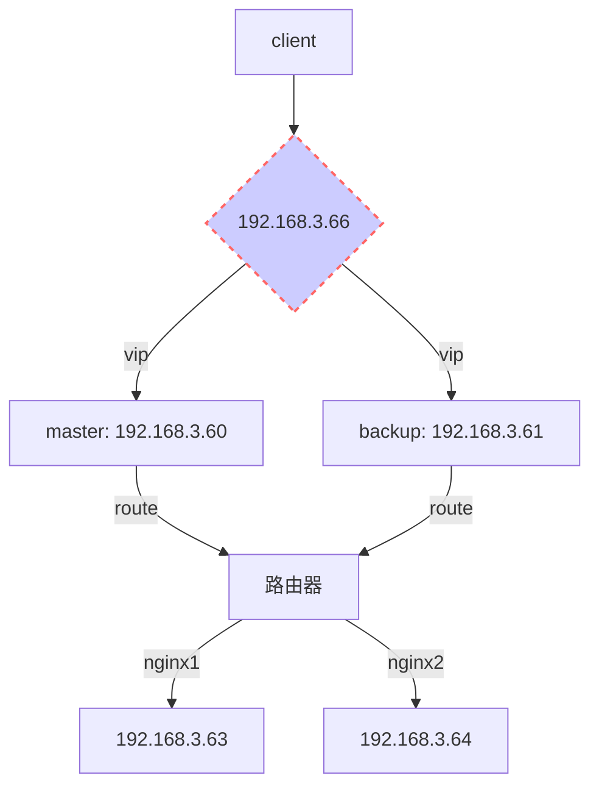

# nginx高可用集群

操作系统：centos7 

组件：lvs + keepalived


## 环境

**vip:** 192.168.8.25

**master**192.168.3.60

**backup:** 192.168.3.61

**nginx1:** 192.168.3.62

**nginx2:** 192.168.3.63

os: CentOS Linux release 7.3.1611 (Core)

kernal: Linux lvs2 3.10.0-327.el7.x86_64 #1 SMP Thu Nov 19 22:10:57 UTC 2015 x86_64 x86_64 x86_64 GNU/Linux




**负载均衡模式：DR（直接路由）**

## 更改镜像(所有节点)

```sh
$ mv /etc/yum.repos.d/CentOS-Base.repo /etc/yum.repos.d/CentOS-Base.repo.bak && curl -o /etc/yum.repos.d/CentOS-Base.repo http://mirrors.aliyun.com/repo/Centos-7.repo
```


## LVS节点

### 安装keepalive+lvs

```sh
#安装keepalived
$ yum install -y ipvsadm keepalived
$ systemctl enable keepalived
```


### 配置(backup节点修改配置：router_id，state，priority)

```sh
$ mv /etc/keepalived/keepalived.conf /etc/keepalived/keepalived.conf.bak
$ cat <<EOF > /etc/keepalived/keepalived.conf
! Configuration File for keepalived

global_defs {
   notification_email {
   	 #故障接受联系人
     notify@inspireso.org
   }
   #故障发送人
   notification_email_from notify@inspireso.org
   smtp_server 127.0.0.1
   smtp_connect_timeout 30
   #BACKUP上修改为LVS_BACKUP
   router_id LVS_MASTER
}

vrrp_instance VI_1 {
	#BACKUP上修改为BACKUP
    state MASTER
    interface eno16777984
    #虚拟路由标识，主从相同
    virtual_router_id 51
    #BACKUP上修改为90
    priority 100
    advert_int 1
    #主从认证密码必须一致
    authentication {
        auth_type PASS
        auth_pass 1111
    }
    #虚拟IP（VTP）
    virtual_ipaddress {
        192.168.3.66
    }
}

#定义虚拟IP和端口
virtual_server 192.168.3.66 80 {
	#检查真实服务器时间，单位秒
    delay_loop 6
    #设置负载调度算法(rr|wrr|lc|wlc|lblc|dh|sh)
    ##rr:   轮叫调度(Round Robin，RR)
    ##wrr:  加权轮叫(Weighted Round Robin，WRR)
    ##dh:   目标地址散列(Destination Hashing,DH)
    ##sh:   源地址散列(Source Hashing,SH)
    
    ##lc:   最少链接(Least Connections，LC)
    ##wlc:  加权最少链接(Weighted Least Connections，WLC)
    ##lblc: 基于局部性的最少链接(Locality-Based Least Connections，LBLC)
    ##lblcr:带复制的基于局部性最少链接(Locality-Based Least Connections with Replication，LBLCR)
    ##sed:  最短的期望的延迟（Shortest Expected Delay Scheduling，SED）
    ##nq:   最少队列（Never Queue Scheduling，NQ）
    lb_algo sh
    
    #设置LVS负载均衡DR模式(DR|NAT|tun)
    lb_kind DR
    #同一IP的连接60秒内被分配到同一台真实服务器
    persistence_timeout 0
    #使用TCP协议检查realserver状态
    protocol TCP

	#nginx1
    real_server 192.168.3.62 80 {
    	#节点权重值
        weight 1
        #健康检查方式
        HTTP_GET {
            url {
              path /
              status_code 200
            }
            #连接超时
            connect_timeout 3
            #重试次数
            nb_get_retry 3
            #重试间隔/S
            delay_before_retry 3
        }
    }

	#nginx2
    real_server 192.168.3.63 80 {
        weight 1
        HTTP_GET {
            url {
              path /
              status_code 200
            }
            connect_timeout 3
            nb_get_retry 3
            delay_before_retry 3
        }
    }
}

EOF
```


### 启动服务

```sh
$ systemctl enable keepalived && systemctl restart keepalived
```


### 防火墙配置

```sh
#卸载firewalld
$ systemctl disable firewalld && yum remove -y firewalld
#安装iptables
$ yum install -y iptables-services

#配置防火墙参考
$ vi /etc/sysconfig/iptables
#默认禁止访问
:INPUT DROP [0:0]
:FORWARD DROP [0:0]
:OUTPUT ACCEPT [0:0]
-A INPUT -m state --state RELATED,ESTABLISHED -j ACCEPT
# 允许vrrp协议
# master(192.168.3.60)添加如下规则
-A INPUT -s 192.168.3.61/24 -i eno16777984 -p vrrp -j ACCEPT
# backup(192.168.3.61)添加如下规则
-A INPUT -s 192.168.3.60/24 -i eno16777984 -p vrrp -j ACCEPT
#允许ssh
-A INPUT -p tcp -m state --state NEW -m tcp --dport 22 -j ACCEPT
#允许访问80，443
-A INPUT -p tcp -m state --state NEW -m tcp --dport 80 -j ACCEPT
-A INPUT -p tcp -m state --state NEW -m tcp --dport 443 -j ACCEPT

-A INPUT -j REJECT --reject-with icmp-host-prohibited
-A FORWARD -j REJECT --reject-with icmp-host-prohibited
COMMIT

#配置默认启动iptables并重启iptables防火墙
$ systemctl enable iptables.service && systemctl restart iptables.service
```


## nginx节点

```sh
#开放80端口
$ firewall-cmd --zone=public --add-port=80/tcp --permanent
$ systemctl restart firewalld
$ yum install net-tools
$ echo <<EOF > /etc/init.d/real.sh
#!/bin/bash

VIP=192.168.3.66

case "$1" in
  start)
    ip addr add $VIP/32 broadcast $VIP dev lo label lo:0
    ip route add $VIP scope link src $VIP dev lo:0
    echo "1" >/proc/sys/net/ipv4/conf/lo/arp_ignore
    echo "2" >/proc/sys/net/ipv4/conf/lo/arp_announce
    echo "1" >/proc/sys/net/ipv4/conf/all/arp_ignore
    echo "2" >/proc/sys/net/ipv4/conf/all/arp_announce
    sysctl -p >/dev/null 2>&1
    echo "RealServer Start OK"
    ;;
  stop)
    ip addr del $VIP/32 dev lo:0
    #ip route del $VIP dev lo:0
    echo "0" >/proc/sys/net/ipv4/conf/lo/arp_ignore
    echo "0" >/proc/sys/net/ipv4/conf/lo/arp_announce
    echo "0" >/proc/sys/net/ipv4/conf/all/arp_ignore
    echo "0" >/proc/sys/net/ipv4/conf/all/arp_announce
    echo "RealServer Stoped"
    ;;
  *)
    echo "Usage: $0 {start|stop}"
    exit 1
esac

exit 0
EOF

$ chmod +x /etc/init.d/real.sh
$ /etc/init.d/real.sh start

# 配置开机自动启动
$ echo "/etc/init.d/real.sh start" >> /etc/rc.d/rc.local
$ chmod +x /etc/rc.d/rc.local
$ systemctl enable rc-local && systemctl start rc-local.service
```

### 防火墙配置

```sh
#卸载firewalld
$ systemctl disable firewalld && yum remove -y firewalld
#安装iptables
$ yum install -y iptables-services

#配置防火墙参考
$ vi /etc/sysconfig/iptables
#默认禁止访问
:INPUT DROP [0:0]
:FORWARD DROP [0:0]
:OUTPUT ACCEPT [0:0]
-A INPUT -m state --state RELATED,ESTABLISHED -j ACCEPT
#允许ssh
-A INPUT -p tcp -m state --state NEW -m tcp --dport 22 -j ACCEPT
#允许访问80，443
-A INPUT -p tcp -m state --state NEW -m tcp --dport 80 -j ACCEPT
-A INPUT -p tcp -m state --state NEW -m tcp --dport 443 -j ACCEPT

-A INPUT -j REJECT --reject-with icmp-host-prohibited
-A FORWARD -j REJECT --reject-with icmp-host-prohibited
COMMIT

#配置默认启动iptables并重启iptables防火墙
$ systemctl enable iptables.service && systemctl restart iptables.service
```

## ipvsadm

### 集群服务管理类命令

```sh
# 添加集群
ipvs -A -t|u|f service-address [-s scheduler]
-t: TCP协议的集群 
-u: UDP协议的集群 
    service-address:     IP:PORT 
-f: FWM: 防火墙标记 
    service-address: Mark Number
#示例
ipvsadm -A -t 172.16.1.253:80 -s wlc

# 修改集群
ipvs -E -t|u|f service-address [-s scheduler]
#示例
ipvsadm -E -t 172.16.1.253:80 -s wrr

#  删除集群
ipvsadm -D -t|u|f service-address
# 示例 
ipvsadm -D -t 172.16.1.253:80
```

### 管理集群中的RealServer

```sh
#  添加RS
ipvsadm -a -t|u|f service-address -r server-address [-g|i|m] [-w weight]
-t|u|f service-address：事先定义好的某集群服务 
-r server-address: 某RS的地址，在NAT模型中，可使用IP：PORT实现端口映射； 
[-g|i|m]: LVS类型    
    -g: DR 
    -i: TUN 
    -m: NAT 
[-w weight]: 定义服务器权重
#示例
ipvsadm -a -t 172.16.1.253:80 -r 172.16.1.101 –g -w 5
ipvsadm -a -t 172.16.1.253:80 -r 172.16.1.102 –g -w 10

# 修改RS
ipvsadm -e -t|u|f service-address -r server-address [-g|i|m] [-w weight]
#示例
ipvsadm -e -t 172.16.1.253:80 -r 172.16.1.101 –g -w 3

#  删除RS
ipvsadm -d -t|u|f service-address -r server-address
#示例
ipvsadm -d -t 172.16.1.253:80 -r 172.16.1.101
```

### 查看类

```sh
ipvsadm -L|l [options]
#常用选项[options]如下：
-n: 数字格式显示主机地址和端口 
--stats：统计数据 
--rate: 速率 
--timeout: 显示tcp、tcpfin和udp的会话超时时长 
-c: 显示当前的ipvs连接状况
```

### 其他管理类

```sh
#删除所有集群服务
ipvsadm -C
#保存规则
service ipvsadm save
ipvsadm -S > /path/to/somefile
```


## 其他注意事项

- 关于时间同步：各节点间的时间偏差不大于1s，建议使用统一的ntp服务器进行更新时间；
- DR模型中的VIP的MAC广播问题：

在DR模型中，由于每个节点均要配置VIP，因此存在VIP的MAC广播问题，在现在的linux内核中，都提供了相应kernel 参数对MAC广播进行管理，具体如下：

**arp_ignore: 定义接收到ARP请求时的响应级别；**

0：只要本地配置的有相应地址，就给予响应； 
1：仅在请求的目标地址配置在到达的接口上的时候，才给予响应；DR模型使用

**arp_announce：定义将自己地址向外通告时的通告级别；**

0：将本地任何接口上的任何地址向外通告； 
1：试图仅向目标网络通告与其网络匹配的地址；
2：仅向与本地接口上地址匹配的网络进行通告；DR模型使用

