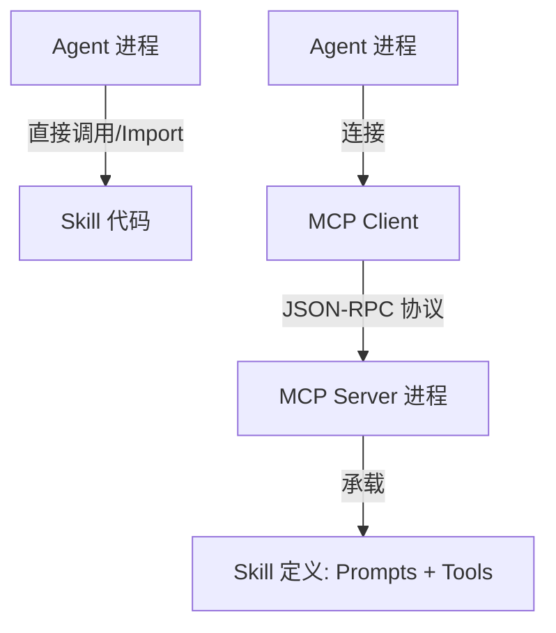
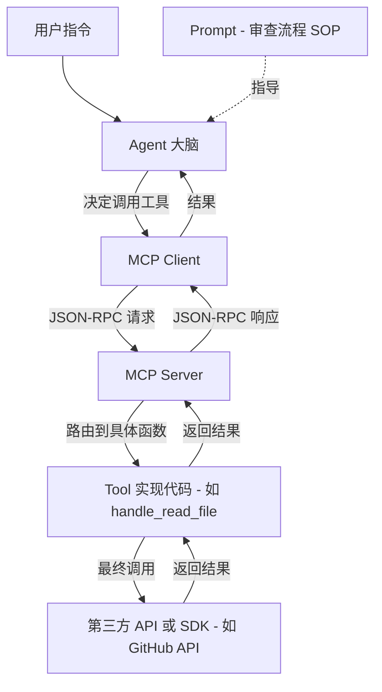
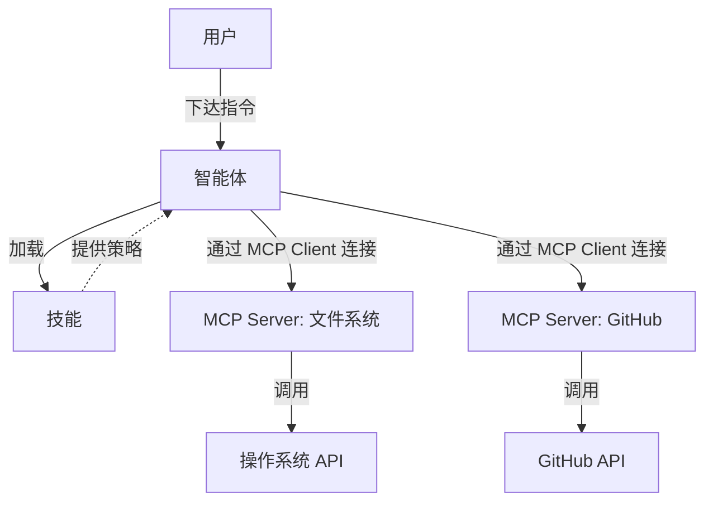

# AI 核心概念解析：MCP、Agent、Skill 与第三方 API

本文档详细描述了 Model Context Protocol (MCP)、Agent（智能体）、Skill（技能）以及第三方系统 API 的概念、作用，并阐述了它们之间如何协作构成完整的 AI 生态系统。

## 1. Model Context Protocol (MCP)

**定义**：
Model Context Protocol (MCP) 是一个开放标准，用于将 AI 助手（AI Assistants）连接到数据所在的系统（如内容库、业务工具、开发环境）。

**核心作用**：
*   **标准化连接**：它提供了一种通用的方式，让 AI 模型能够访问本地或远程的数据和工具，而无需为每个服务编写特定的集成代码。
*   **上下文增强**：通过 MCP，AI 可以获取实时的、私有的或特定领域的上下文信息，从而生成更准确、更相关的回答。
*   **架构解耦**：MCP 采用了客户端-主机-服务器（Client-Host-Server）架构，使得 AI 应用（客户端）与数据源（服务器）可以独立演进。

**主要组件**：
*   **MCP Server**：暴露数据（Resources）、工具（Tools）和提示词（Prompts）的轻量级服务。它是连接 AI 与具体第三方服务的**适配器**。
*   **MCP Client**：与 Server 通信的 AI 应用程序（如 Claude Desktop, Trae 等 IDE）。
*   **Resources**：AI 可以读取的数据（如文件、数据库记录）。
*   **Tools**：AI 可以执行的可执行函数（如 API 调用、脚本执行）。
*   **Prompts**：预定义的模板，帮助用户更有效地使用 Server 的功能。

## 2. Agent (智能体)

**定义**：
Agent 是一个具有自主性的 AI 系统，它利用大语言模型（LLM）作为核心“大脑”，具备感知、规划、决策和执行的能力，以完成特定的目标。

**核心特征**：
*   **自主性 (Autonomy)**：Agent 可以根据目标独立工作，不需要人类对每一步进行干预。
*   **推理与规划 (Reasoning & Planning)**：Agent 能够分解复杂任务，制定执行步骤，并根据反馈调整计划。
*   **工具使用 (Tool Use)**：Agent 能够调用外部工具（如搜索、代码执行、API 调用）来改变环境或获取信息。
*   **记忆 (Memory)**：Agent 通常具备短期或长期记忆，以维护任务上下文。

**工作模式**：
用户给出一个高层指令（如“构建一个个人博客”），Agent 会自动分析需求、生成代码、运行测试、修复错误，直到任务完成。

## 3. Skill (技能)

**定义**：
Skill 是赋予 Agent 的特定领域的专业能力或知识包。它通常是一组经过封装的工具、工作流或最佳实践，旨在解决特定类型的问题。

**核心作用**：
*   **能力模块化**：Skill 将复杂的领域知识（如“前端设计”、“文档编写”、“数据库优化”）封装成可复用的模块。
*   **指导与约束**：Skill 不仅提供工具，还可能包含特定的 Prompt 或流程指引，确保 Agent 按照专家的模式行事。
*   **场景化应用**：当 Agent 遇到特定场景（如需要生成 Slack GIF）时，可以加载对应的 Skill 来高效完成任务。

**与 Tool 的区别**：
Tool 通常是原子的操作（如“读取文件”），而 Skill 往往是更高层次的能力集合（如“根据设计规范编写文档”），可能包含多个 Tool 的组合使用策略。

## 4. 第三方系统 API (Third-Party APIs)

**定义**：
第三方系统 API 是外部服务（如 GitHub, Stripe, Google Drive, 公司内部数据库等）提供的原始编程接口，用于访问其核心数据和功能。

**在体系中的角色**：
*   **数据源头与执行终端**：这是数据真正存储的地方，也是业务逻辑最终执行的地方。
*   **被封装对象**：MCP Server 实际上是对这些 API 的封装。MCP Server 负责处理认证、数据格式转换和协议适配，将复杂的 API 转化为 AI 易于理解和调用的标准 MCP Tool 或 Resource。

## 5. 深度辨析：Skill 与 MCP 的关系

虽然 Skill 和 MCP 都扩展了 AI 的能力，但它们处于不同的抽象层级，解决了不同的问题。

### 1. 抽象层级不同 (Layering)
*   **MCP (基础设施层)**：关注的是**连接性 (Connectivity)**。它解决了“AI 如何跟这个特定的数据库/API 对话”的问题。它是底层的、原子的、通用的。
    *   *例子*：一个 PostgreSQL MCP Server 提供了 `execute_sql` 工具。它不关心你执行什么 SQL，只负责执行。
*   **Skill (应用逻辑层)**：关注的是**方法论 (Methodology)**。它解决了“AI 如何利用现有工具来完成一个复杂的业务任务”的问题。它是高层的、组合的、特定的。
    *   *例子*：一个“数据分析 Skill”知道如何先查询表结构，再生成统计 SQL，最后绘制图表。它底层调用的正是那个 PostgreSQL MCP Server 提供的 `execute_sql` 工具。

### 2. 依赖关系 (Dependency)
*   **Skill 往往依赖于 MCP**：一个 Skill 的执行过程，通常需要调用一个或多个 MCP Server 提供的工具（Tools）或读取其资源（Resources）。
*   **MCP 不依赖于 Skill**：MCP Server 独立存在，它只是忠实地暴露数据和功能，不知道谁会来调用它。

### 3. 复用性 (Reusability)
*   **MCP Server**：高度可复用。一个“文件系统 MCP”可以被“代码编辑 Skill”、“日志分析 Skill”、“文档生成 Skill”等多个不同的 Skill 使用。
*   **Skill**：针对特定任务复用。比如“前端开发 Skill”包含了一套前端开发的最佳实践，可以在不同的前端项目中使用。

### 总结表格

| 特性 | MCP (Model Context Protocol) | Skill (技能) |
| :--- | :--- | :--- |
| **核心关注点** | **连接**：如何访问数据/工具 | **逻辑**：如何解决具体问题 |
| **粒度** | **原子级**：单一的 API 调用或数据读取 | **复合级**：工作流、策略、多步骤操作 |
| **角色类比** | **手和眼**：感知和操作的器官 | **大脑皮层**：学会的专业知识和套路 |
| **典型例子** | `read_file`, `git_commit`, `query_db` | `RefactorCode`, `WritePRD`, `DebugError` |

## 6. Agent 与 Skill 的交互协议 (Interaction Protocol)

**Agent 调用 Skill 是否必须依赖 MCP？**
**答案：不一定。** Skill 可以是 Agent 内部集成的代码模块，也可以是封装在 MCP Server 中的远程能力。

### 1. 模式一：原生集成 (Native/Internal Integration)
*   **协议**：**编程语言内部调用 (Function Call / Import)**。
*   **形式**：Skill 以 Python 类、JavaScript 模块或插件的形式直接运行在 Agent 的进程中。
*   **特点**：
    *   **紧耦合**：Skill 与 Agent 共享运行时环境。
    *   **高性能**：没有网络开销。
    *   **场景**：核心能力（如“记忆管理”、“任务规划”），或 Agent 框架自带的标准插件。

### 2. 模式二：MCP 封装 (MCP-based Skills)
*   **协议**：**Model Context Protocol (基于 JSON-RPC)**。
*   **形式**：Skill 被封装在 MCP Server 中，以 **Prompts (指导策略)** 和 **Tools (执行能力)** 的形式暴露。
*   **原理**：
    *   Agent 并不“运行”Skill 的代码，而是连接到 MCP Server。
    *   Server 提供 Prompt（例如：“作为一名数据分析师，你应该先执行 A，再执行 B”）。
    *   Agent 读取 Prompt 获得“技能”，并通过 MCP 协议调用 Server 提供的 Tools 来执行操作。
*   **特点**：
    *   **松耦合**：Agent 与 Skill 可以用不同语言编写，运行在不同机器上。
    *   **标准化**：任何支持 MCP 的 Agent 都可以使用这个 Skill，无需适配。
    *   **场景**：第三方扩展能力、需要访问特定环境的技能（如“本地文件操作”、“公司内网数据库操作”）。

### 3. 交互模式对比图 (Mermaid)

以下图表直观展示了这两种交互模式的区别。

### 结论
*   **Skill 是逻辑概念**：代表一种“解决问题的能力”。
*   **MCP 是传输协议**：是目前实现 Skill **跨平台、跨应用分发**的最佳标准。

## 7. 深入解析：MCP Server 如何承载 Skill

在 MCP 架构中，**Skill** 并不是一个独立的实体对象，而是通过 **Prompts (策略)** 和 **Tools (能力)** 的组合在 MCP Server 中体现的。

### 1. Skill 的构成要素
当我们在 MCP Server 中“承载”一个 Skill 时，实际上是定义了以下两部分：

*   **Prompts (大脑的说明书/SOP)**：
    *   **作用**：告诉 Agent **“在什么场景下，按照什么步骤，使用什么策略”** 来解决问题。
    *   **形式**：预定义的提示词模板。
    *   *例子*：一个 `CodeReviewSkill` 可能包含一个名为 `review_pr` 的 Prompt，内容是：“你是一个资深代码审查员。在审查代码时，请先检查架构设计，再检查代码风格，最后运行测试。请使用 `read_file` 读取代码，使用 `run_test` 运行测试。”
*   **Tools (手脚的工具箱)**：
    *   **作用**：提供 Agent **“实际执行操作”** 的能力。
    *   **形式**：可被调用的函数定义（名称、参数、描述）。
    *   *例子*：`read_file`, `run_test`, `post_comment`。

### 2. 最终调用关系 (Call Flow)
Agent 使用 Skill 的过程，本质上是 **Agent 遵循 Prompt 的指引，去调用 Tool，最终触发底层 API** 的过程。

**完整调用链路：**

#### 1. Agent (决策层)
*   用户请求：“帮我审查一下这个 PR”。
*   Agent 从 MCP Server 获取 `review_pr` Prompt，理解了审查流程。
*   Agent 决定：“好，我先读取文件”。-> **发起 `read_file` 工具调用**。

#### 2. MCP Client (传输层)
*   将工具调用请求序列化为 JSON-RPC 消息，发送给 MCP Server。

#### 3. MCP Server (适配层)
*   接收请求，找到 `read_file` 对应的后端代码（Python/JS 函数）。
*   **执行逻辑**：该函数内部执行实际的 IO 操作或 API 请求。

#### 4. 底层 API (执行层)
*   **最终动作**：操作系统执行 `fs.readFile` 或 GitHub SDK 发送 HTTP 请求。

### 3. 调用关系图示 (Mermaid)

## 8. 四者之间的协作关系

这四个概念共同构成了一个从用户指令到底层系统执行的完整链路：

1.  **Agent (大脑)**：负责理解用户意图，进行规划和决策。
2.  **Skill (专业知识)**：Agent 加载 Skill 以获得处理特定任务的专业策略。
3.  **MCP (标准接口)**：Agent 通过 MCP 协议，以统一的方式调用外部能力。
4.  **第三方 API (实际执行)**：MCP Server 接收请求后，在后台调用具体的第三方 API 来完成实际操作。

**简而言之**：
*   **Agent** = 指挥官
*   **Skill** = 战术手册
*   **MCP** = 通用翻译器/适配器
*   **第三方 API** = 实际干活的机器

### 关系图示 (Mermaid)

以下是四者关系的简化版图示，移除了所有复杂样式以确保兼容性。

