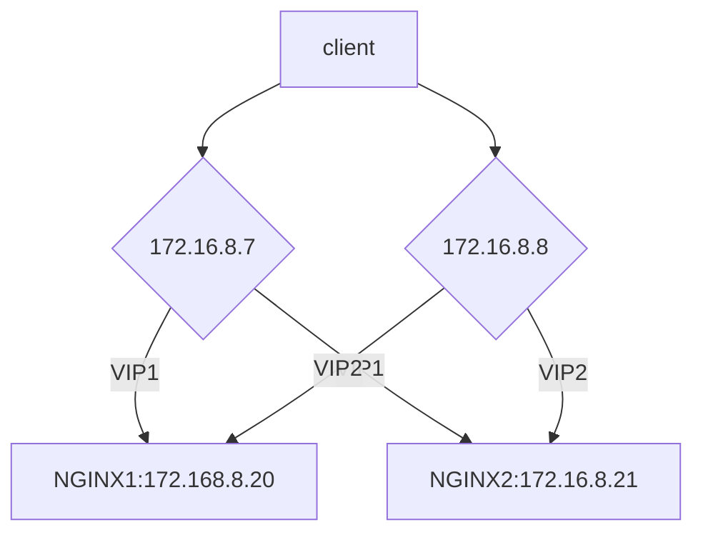

# nginx高可用集群

操作系统：centos7 

组件：keepalived+nginx


## 环境

**vip:** 172.16.8.7

**master**: 172.16.8.20

**backup:** 172.16.8.20

os: CentOS Linux release 7.4.1708 (Core)

kernal: 3.10.0-693.el7.x86_64 #1 SMP Tue Aug 22 21:09:27 UTC 2017 x86_64 x86_64 x86_64 GNU/Linux




## 更改镜像(所有节点)

```sh
mv /etc/yum.repos.d/CentOS-Base.repo /etc/yum.repos.d/CentOS-Base.repo.bak && curl -o /etc/yum.repos.d/CentOS-Base.repo http://mirrors.aliyun.com/repo/Centos-7.repo
```

## 防火墙

```sh
#卸载firewalld
$ systemctl disable firewalld && yum remove -y firewalld
#安装iptables
$ yum install -y iptables-services

#配置防火墙参考
$ vi /etc/sysconfig/iptables
#-p 112指定协议为112，也可-p vrrp即vrrp，keepalived组播地址是224.0.0.18
-A INPUT -p vrrp -d 224.0.0.18/32 -j ACCEPT
#允许访问80，443
-A INPUT -p tcp -m state --state NEW -m tcp --dport 80 -j ACCEPT
-A INPUT -p tcp -m state --state NEW -m tcp --dport 443 -j ACCEPT


#配置默认启动iptables并重启iptables防火墙
$ systemctl enable iptables.service && systemctl restart iptables.service
```


## nginx

### 安装

```sh
curl -o tengine-2.2.0-centos7.tar.gz  "https://raw.githubusercontent.com/inspireso/docs/master/resources/tengine-2.2.0-centos7.tar.gz" 
tar xzf tengine-2.2.0-centos7.tar.gz -C /
#添加nginx用户和用户组
useradd -d /var/cache/nginx -s /sbin/nologin -U nginx

```

### 配置

#### 修改最大连接数

- /etc/security/limits.conf

```sh
#修改最大连接数
echo root soft nofile 65535 >> /etc/security/limits.conf
echo root hard nofile 65535 >> /etc/security/limits.conf
echo * soft nofile 65535 >> /etc/security/limits.conf
echo * hard nofile 65535 >> /etc/security/limits.conf
```

- /usr/local/nginx/conf/nginx.conf

```sh
worker_processes  auto;
worker_cpu_affinity auto;
worker_rlimit_nofile 65535;
events {
    worker_connections  65535;
}
```

### 启动nginx

```sh
# 系统自动启动
systemctl enable nginx && systemctl start nginx.service
```


## keepalive

### 安装

```sh
#安装keepalived
$ yum install -y keepalived
$ systemctl enable keepalived
```

### 配置

####  nginx_check.sh

```sh
#nginx检查脚本
cat <<EOF > /etc/keepalived/nginx_check.sh
#!/bin/bash
A=`ps -C nginx --no-header | wc -l`
if [ $A -eq 0 ];then
    systemctl restart nginx
    sleep 2
    if [ `ps -C nginx --no-header | wc -l` -eq 0 ];then
        systemctl stop keepalived
    fi
fi
EOF
chmod +x /etc/keepalived/nginx_check.sh
```

#### notify.sh

```sh
cat <<EOF > /etc/keepalived/notify.sh
#!/bin/bash
# description: An example of notify script
#

vip=$2
contact="root@localhost"

notify() {
  local mailsubject="$(hostname) to be $1, $vip floating"
  local mailbody="$(date +'%F %T'): vrrp transition, $(hostname) changed to be $1"
  echo "$mailbody" | mail -s "$mailsubject" $contact
}

case "$1" in
  master)
    notify master
    exit 0
  ;;
  backup)
    notify backup
    exit 0
  ;;
  fault)
    notify fault
    exit 0
  ;;
  *)
    echo 'Usage:  {master|backup|fault}'
    exit 1
  ;;
esac
EOF
chmod +x /etc/keepalived/notify.sh
```


#### keepalived.conf

(backup节点修改配置：router_id，state，priority)

```sh
#配置keepalived
mv /etc/keepalived/keepalived.conf /etc/keepalived/keepalived.conf.bak
$ cat <<EOF > /etc/keepalived/keepalived.conf
global_defs {
   notification_email {
     winlu.tec@sunisco.com
   }
   notification_email_from web@sunisco.com
   smtp_server 127.0.0.1
   smtp_connect_timeout 30
   router_id nginx001
}
## keepalived会定时执行脚本并对脚本执行的结果进行分析,动态调整vrrp_instance的优先级。
##如果脚本执行结果为0,并且weight配置的值大于0,则优先级相应的增加。如果脚本执行结果非0,
##并且weight配置的值小于 0,则优先级相应的减少。其他情况,维持原本配置的优先级,即配置文件中priority对应的##值。
vrrp_script chk_nginx {
   script "/etc/keepalived/nginx_check.sh"
   #每2秒检测一次nginx的运行状态
   interval 2
   #失败一次，将自己的优先级-20
   #weight为正数
   #如果脚本执行结果为0,,Master:weight+priority>Backup:weight+priority(不切换)
   #如果脚本执行结果不为0,Master:priority<Backup:priority+weight(切换)
   #weight为负数
   #如果脚本执行结果为0,,Master:priority>Backup:priority(不切换)
   #如果脚本执行结果不为0,Master:priority+weight<Backup:priority(切换)
   #一般来说,weight的绝对值要大于Master和Backup的priority之差
   weight -20 
}

vrrp_instance VI_1 {
    #NGINX2上修改为BACKUP
    # 状态，主节点为MASTER，备份节点为BACKUP
    state MASTER
    # 绑定VIP的网络接口，通过nmcli con sh查看自己的网络接口
    interface bro0
    # 虚拟路由的ID号,两个节点设置必须一样,可选IP最后一段使用,相同的VRID为一个组,他将决定多播的MAC地址
    virtual_router_id 51
    #NGINX2上修改为90
    # 节点优先级，值范围0～254，MASTER要比BACKUP高
    priority 100
    # 组播信息发送时间间隔，两个节点必须设置一样，默认为1秒
    advert_int 1
    # 设置验证信息，两个节点必须一致
    authentication {
        auth_type PASS
        auth_pass 1111
    }
    # 虚拟IP，两个节点设置必须一样。可以设置多个，一行写一个
    virtual_ipaddress {
        172.16.8.7
    }

    track_script {
        # nginx存活状态检测脚本
        chk_nginx  
    }
}

vrrp_instance VI_2 {
    #NGINX2上修改为MASTER
    state BACKUP
    interface bro0
    virtual_router_id 52
    priority 90
    advert_int 1
    authentication {
        auth_type PASS
        auth_pass 1111
    }
    virtual_ipaddress {
        172.16.8.8
    }

    track_script {
        # nginx存活状态检测脚本
        chk_nginx  
    }
}

EOF
```

### 启动服务

```sh
$ systemctl enable keepalived && systemctl restart keepalived
```


